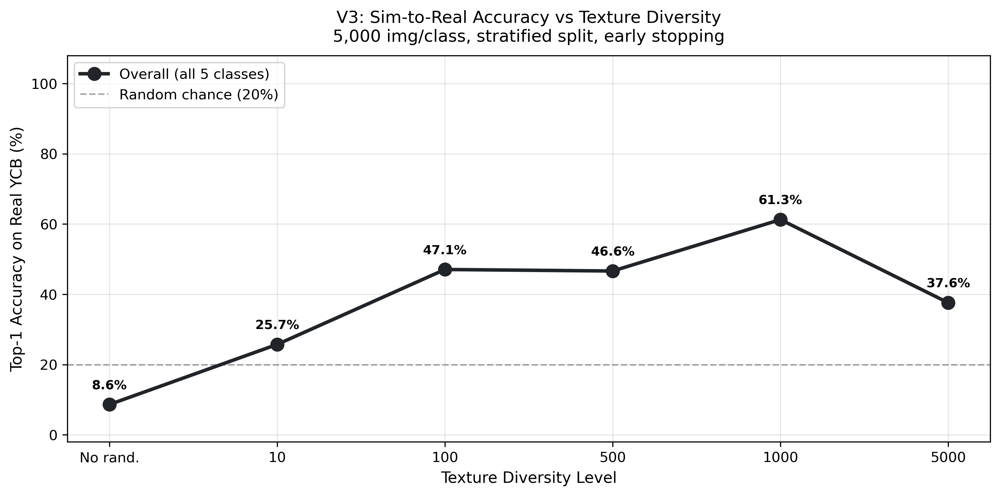
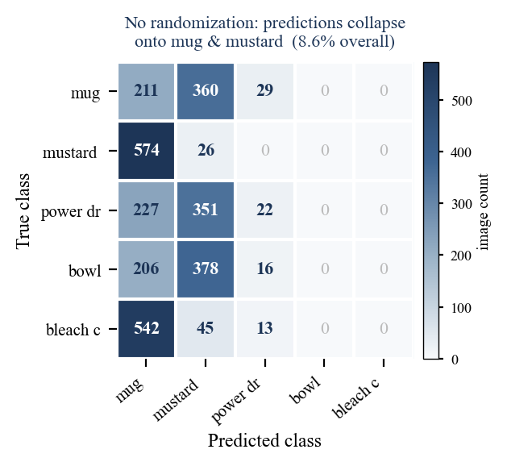
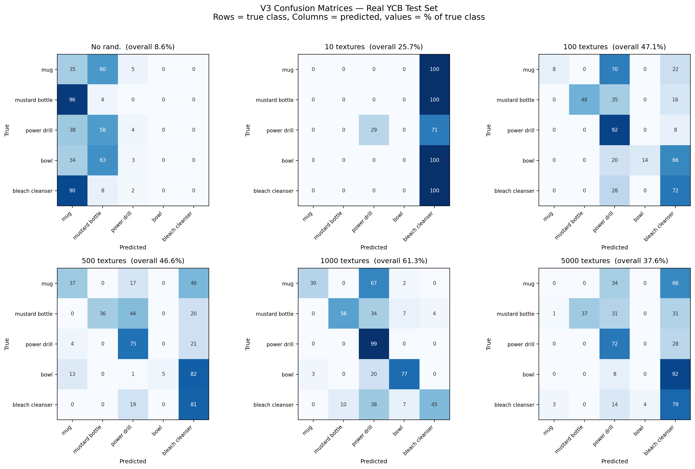
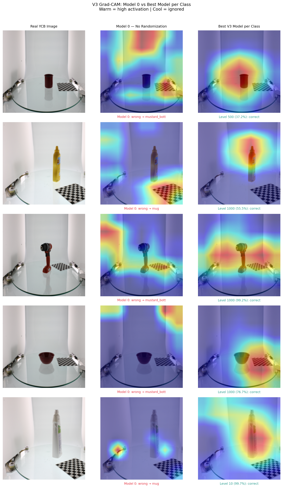
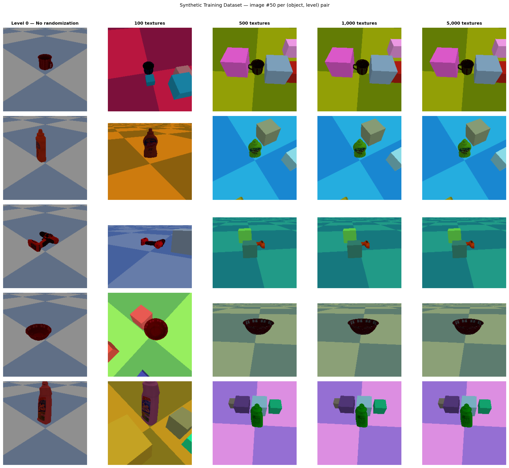
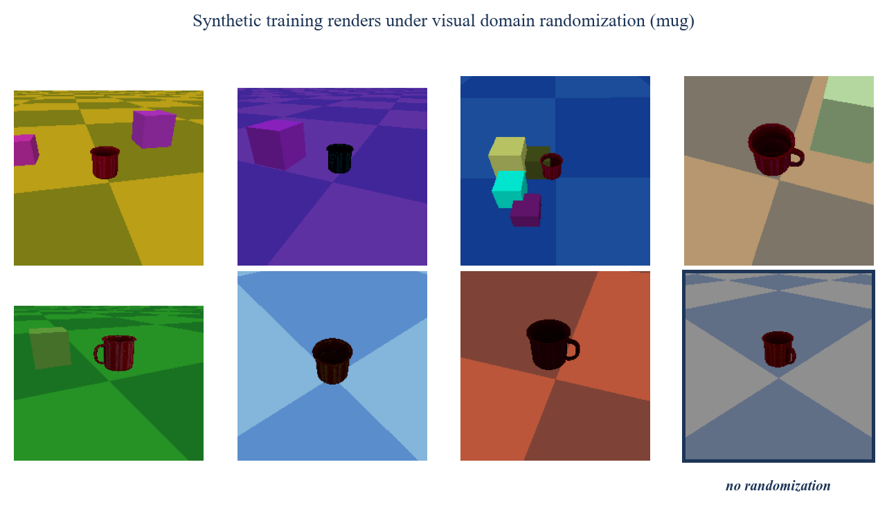

# Born in Simulation

**How visual domain randomization bridges the sim-to-real gap for object recognition.**
*An empirical study of colour diversity and learned representations, grounded in Tobin et al. (2017).*

Six ResNet-18 classifiers were fine-tuned on **entirely synthetic** PyBullet renders
and evaluated on **3,000 real photographs** they never saw during training. The only
variable between them was how much visual diversity the renderer produced.

Randomization takes real-world accuracy from **8.6% to 61.3%**: from below chance
to a working classifier, with zero real training images.

A control comparison afterwards showed that the *shape* of the curve should be read
with caution: two conditions with identical diversity differed by as much as the
curve's headline feature. See
[What the variance check showed](#what-the-variance-check-showed).

<p align="center">
  
</p>

## Results

| Diversity level | Unique scenes/class | Real-world top-1 |
|---:|---:|---:|
| 0 (no randomization) | 1 | 8.6% |
| 10 | 10 | 25.7% |
| 100 | 100 | 47.1% |
| 500 | 500 | 46.6% |
| 1,000 | 1,000 | 61.3% |
| 5,000 | 5,000 | 37.6% |

Chance is 20% for five classes. The no-randomization baseline lands **below chance**,
which sounds like a broken experiment until you look at what it predicts.

<p align="center">
  
</p>

It isn't guessing. It collapses onto two classes. 58.7% of its 3,000 predictions are
"mug", 38.7% are "mustard bottle", and it never once predicts bowl or bleach cleanser.
It has confidently learned a background shortcut that exists in simulation and not in
reality, so it is *reliably* wrong rather than uniformly uncertain. Below-chance
accuracy is the signature of a learned shortcut, not of noise.

### Prediction collapse is the mechanism

Share of all 3,000 test predictions assigned to each class:

| Level | mug | mustard | drill | bowl | bleach | entropy | accuracy |
|---:|---:|---:|---:|---:|---:|---:|---:|
| 0 | 58.7% | 38.7% | 2.7% | 0.0% | 0.0% | 1.12 | 8.6% |
| 10 | 0.0% | 0.0% | 5.9% | 0.0% | **94.1%** | 0.32 | 25.7% |
| 100 | 1.8% | 9.7% | 49.0% | 2.7% | 36.8% | 1.61 | 47.1% |
| 500 | 10.9% | 7.2% | 31.0% | 0.9% | 50.0% | 1.71 | 46.6% |
| 1,000 | 6.7% | 13.2% | 51.7% | **18.8%** | 9.6% | **1.92** | 61.3% |
| 5,000 | 0.9% | 7.4% | 31.9% | 0.7% | 59.1% | 1.37 | 37.6% |

<p align="center">
  
</p>

Maximum entropy for five balanced classes is 2.32. Every model over-assigns to a
dominant class, with the top share running from 49% to 94%. What separates level 1,000
is not that it avoids this but that it is less lopsided across the remaining classes:
entropy 1.92 against 0.32 to 1.71 elsewhere, and it is the only model that predicts
"bowl" with any regularity, at 18.8% of its predictions against 0 to 2.7% at every
other level. That is why bowl accuracy reaches 76.7% there and sits near zero
everywhere else. Across the six models, prediction entropy correlates +0.72 with
real-world accuracy.

Level 10 deserves its own caveat: 94.1% of its predictions are bleach cleanser, and
its 25.7% comes almost entirely from 598 of 600 correct bleach plus 174 correct drills.
It is a two-class predictor exhibiting the same collapse as the baseline, aimed at a
different class, not a partial recovery.

The coherent account across the whole experiment: models trained on insufficiently
diverse simulation learn a shortcut and collapse onto one or two classes when shown
real photographs. Diversity's function is to widen that collapse, not to eliminate it.

## What the network learns

<p align="center">
  
</p>

Grad-CAM at the final convolutional block makes it visible. The no-randomization model
attends to background (the wall behind the mug, the floor beneath the mustard bottle)
and predicts wrongly. The best diversity model puts its attention on the object and
predicts correctly. The bleach cleanser is the clearest case: the baseline scatters
weak activation across the lower frame and answers "mug"; the diverse model
concentrates a tight hotspot on the bottle.

Randomization doesn't teach the model about colour. It makes background
*uninformative*, forcing reliance on the one cue stable across renders: object shape.

## Pretraining ablation

| Condition | Pretrained | Scratch (lr 1e-4) | Scratch (lr 1e-3) |
|---|---:|---:|---:|
| No randomization | 8.6% | 20.0% | 20.0% |
| Level 1,000 | 61.3% | 25.0% | 28.4% |

The 20.0% is not a result. It's a degenerate constant predictor emitting one class for
all 3,000 images, which happens to land exactly on chance.

The from-scratch runs were repeated at a 10x higher learning rate, since 1e-4 is tuned
for fine-tuning and random initialization normally wants more. It moved level 1,000
from 25.0% to 28.4%, leaving a **32.9-point** gap against the pretrained model. The
pretraining advantage is not an artifact of an under-tuned baseline.

The reading: synthetic data teaches the network how to *recombine* pretrained features,
not how to learn good features from nothing. This locates a **scale boundary** beneath
the regime where Tobin et al. found pretraining unnecessary, and identifies data volume
as the variable separating the two.

## What the variance check showed

The submitted paper reports the accuracy curve as non-monotonic, with a peak at level
1,000 and a decline at 5,000 attributed to overfitting. **A control run afterwards
showed that decline cannot be distinguished from run-to-run variance.**

The control was free, because it was already sitting in the V2 data. V2 used 1,000
images per class, and the seed-cycling term `i mod level` means level 5,000 could only
ever produce 1,000 unique scenes, because `i` never exceeds 999. So in V2, **levels
1,000 and 5,000 had identical diversity**, differing only in which seeds drew the scenes.

| | Level 1,000 | Level 5,000 | Drop |
|---|---:|---:|---:|
| V2, identical diversity by construction | 65.3% | 40.8% | **−24.5** |
| V3, 1,000 vs 5,000 unique scenes | 61.3% | 37.6% | **−23.7** |

The V2 drop is pure scene-sampling and training variance. The V3 drop, which the paper
reports as its headline finding, is the same magnitude to within 0.8 points.

Measured against that noise floor:

| Comparison | Effect | Status |
|---|---:|---|
| No randomization to level 1,000 | +52.7 | **Robust** |
| No randomization to level 100 | +38.5 | **Robust** |
| Pretrained vs from-scratch at level 1,000 | +32.9 | **Holds** |
| Level 10 to level 100 | +21.4 | Within noise |
| Level 100 to level 1,000 | +14.2 | Within noise |
| Level 1,000 to level 5,000 | −23.7 | Within noise |

**What this does and does not mean.** It does not mean the decline is false. It means
this experiment cannot tell the difference between a real decline and noise, so
asserting one is not supported. The central claim, that randomization dramatically
improves sim-to-real transfer, survives at roughly twice the noise floor, appears in
both V2 and V3, and involves a qualitative change in failure mode, not just a higher
number.

Two honest caveats on the caveat. The 24.5-point figure is a *single* pairwise
difference, which is a crude estimate of variance; V2's level-5,000 run may have been
an unlucky outlier. And it is probably an underestimate for V3, because V2 used fixed
epochs while V3 added early stopping against a validation split that every model solved
at 99 to 100%. Validation accuracy correlated **+0.006** with real-world accuracy across
the six models, so the stopping signal carried no information about the outcome being
measured. That saturated signal also meant the kept checkpoints ranged from epoch 1 to
epoch 12 across conditions, so effective training length varied uncontrolled alongside
diversity.

The experiment that would settle this is repeated runs per condition with fixed epochs,
producing an accuracy curve with error bars. That is the outstanding work on this
project.

## What went wrong (the first time)

Before any of the above, the first run produced a clean, plausible, invalid result:
levels 500, 1,000 and 5,000 all reported near-identical accuracy.

Diversity is controlled by seed-cycling. The original rule omitted the level offset:

```
s(i) = s0 + (i mod level)
```

With 500 images per class, any level >= 500 satisfies `i mod level == i` for every
`i < 500`. Levels 500, 1,000 and 5,000 drew the same seeds and generated
**identical training data**. The run contained four distinct datasets, not six.
Nothing crashed; the logs were clean. The only symptom was three numbers sitting
suspiciously close together.

The verification figure built to confirm diversity is what documents its absence:

<p align="center">
  
</p>

It samples image index 50 across levels, and because `50 mod level == 50` for every
level >= 100, four of its columns are the same render.

The corrected rule adds object and level offsets, guaranteeing disjoint seed ranges:

```
s(i) = s0 + (obj * C_obj) + (level * C_lev) + (i mod level)
```

This required regenerating every dataset and retraining every model, and the image
budget was raised to 5,000/class. All three runs are preserved in `results/` so the
collision is checkable rather than merely asserted. See
[`results/README.md`](results/README.md).

A silent data-generation bug is more dangerous than a crash, because it hands you
results you can publish.

## Method

Each render loads the object's 16k YCB mesh, places it on a ground plane, and samples:

| Parameter | Range |
|---|---|
| Object and floor colour | random RGBA |
| Camera distance | 0.35 to 0.75 m |
| Camera yaw | 0 to 360 degrees |
| Camera pitch | -70 to -15 degrees |
| Distractor boxes | 0 to 4, randomly coloured |

Distractors follow Tobin et al. directly: they stop the network assuming the largest
or most central object is the target.

<p align="center">
  
</p>

| | |
|---|---|
| Renderer | PyBullet 3.25, `ER_TINY_RENDERER`, headless |
| Objects | 5 YCB items: mug, mustard bottle, power drill, bowl, bleach cleanser |
| Model | ResNet-18, ImageNet-pretrained, `Linear(512 -> 5)` head, **full fine-tuning** |
| Training | 5,000 img/class (150,000 total), Adam at 1e-4, batch 32, early stopping (patience 12, max 100 epochs), 15% stratified per-class validation split |
| Test | 3,000 real YCB photographs (600/class), zero real images in training |
| Hardware | RTX 3060 Laptop, Python 3.11.11, PyTorch 2.2.1+cu121 |

No layers are frozen; every parameter goes to the optimizer.

**Why this is not augmentation.** Image augmentation applies pixel transforms to
existing photographs; the domain is still reality. Here each image is a fresh render of
a re-sampled 3D scene. Varying camera viewpoint in three dimensions and inserting
genuine 3D distractors require a geometric model of the scene and cannot be done by 2D
transforms.

## Limitations

- **Single runs.** Each condition was trained once. As the variance check above shows,
  this is the binding limitation on everything except the largest effects.
- **Saturated validation split.** The 15% split is drawn from the same synthetic
  renders, and every model solved it at 99 to 100%. It could not detect the failure that
  matters, and using it for early stopping meant checkpoints were selected on noise.
  A future version should either use fixed epochs or hold out a small set of real
  images purely for stopping.
- **Colour, not photographic texture.** Tobin et al. mapped real texture images onto
  surfaces. `ER_TINY_RENDERER` offers no arbitrary texture mapping, so the only handle
  on appearance is RGBA applied as a multiplicative tint. Diversity levels here count
  unique *colour* combinations. The hypothesis under test is unchanged, but the
  absolute numbers are not directly comparable to the original work.
- **Five object classes** is a narrow benchmark; any threshold would likely move with
  class count and model capacity.

## Reproducing

```bash
conda env create -f environment.yml
conda activate my_ai_env

python scripts/download_ycb.py                          # meshes + real test images
python src/generate_dataset.py --config configs/default.yaml
python src/train.py           --config configs/default.yaml
python src/evaluate.py        --config configs/default.yaml
python src/gradcam.py         --config configs/default.yaml

python src/train.py --levels 0 1000 --scratch           # pretraining ablation
python src/evaluate.py --levels 0 1000 --scratch
```

Renders (~150k images), YCB assets and checkpoints are not tracked in git. Accuracy
CSVs and training logs are committed under `results/`, so every number above can be
checked without a rerun.

**Note on resuming:** generation skips any level/object folder that already holds
enough PNGs, and training skips any level with an existing checkpoint. Changing the
seed formula or the image count therefore does nothing until the old renders and
checkpoints are deleted.

## Repository layout

```
configs/     experiment configuration: paths, seeds, diversity levels
src/         dataset generation, training, evaluation, Grad-CAM
scripts/     YCB download helper
results/
  v3/        headline run (5,000 img/class): data, figures, summaries
  v2/        1,000 img/class, also the source of the variance control
  v1_buggy/  original run, preserved to document the seed collision
  README.md  what each version is and how they differ
notebooks/   experiment_v1 / v2 / v3, the original working notebooks
paper/       born_in_simulation.pdf (as submitted)
```

## Paper

[`paper/born_in_simulation.pdf`](paper/born_in_simulation.pdf)

Written for **340.910 Seminar in Artificial Intelligence (Physical AI)**, Johannes
Kepler University Linz. Prof. Alois Ferscha, supervised by Aftab Hussain.

The PDF is the version submitted for assessment. The variance analysis in this README
was carried out afterwards and revises the paper's account of the level-5,000 decline;
the paper's own Limitations section anticipates it, noting that models were trained
once and that some non-monotonic behaviour may reflect training variance.

## License

MIT. See [LICENSE](LICENSE). The YCB object and model set is separately licensed by
Calli et al.
